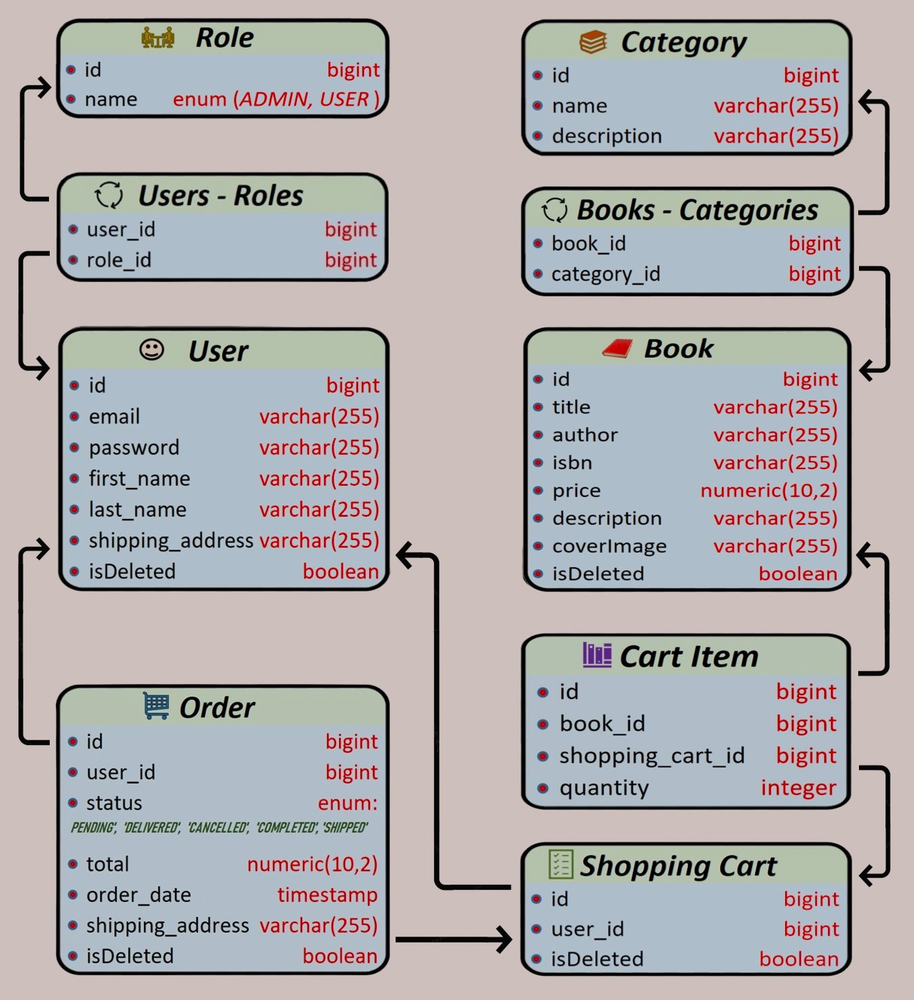

# Table of contents
* [ Introduction ](#introduction)
* [ Project structure ](#project-structure)
* [ Models and relations ](#models-and-relations)
* [ Getting Started ](#getting-started)
* [ Technologies used ](#technologies-used)


## Introduction
* This is a simple, but at the same time functional application for managing an online book store. 
It provides the manager with all the necessary capabilities for forming and maintaining a product base, 
as well as tracking and controlling the customer base. The user, in turn, receives the most convenient, 
understandable functionality for viewing and purchasing books available in the database. 
The application has most powerful data security technologies.

## Project structure:
### For admin:
* Create book category
* Update book category by ID
* Delete book category by ID
* Create book
* Update book by ID
* Delete book by ID
* Change order status

### For all users:
* Registration with proper eMail, creating an eight-character password
* Get all categories (maintaining Pageable and Sorting tools)
* Get category by ID
* Get all books (maintaining Pageable and Sorting tools)
* Get all books by category ID (maintaining Pageable and Sorting tools)
* Get book by ID

### For authorized users only:
* Add item to shooping cart
* Update item in shooping cart
* Delete item from shooping cart
* Get information about shopping cart content
* Create order (all shopping cart items transfer into new order)
* Get all orders
* Get item from order by ID 
* Get all order items (maintaining Pageable and Sorting tools)


## Models and relations


## Getting started
First, ensure you have the following installed:`
- Java Development Kit (JDK)
- Docker and Docker Compose

1. Clone the [**repository**](https://github.com/VadimKadasiev/Book_Store_Project)
2. Create an `.env` file with the necessary environment variables. Use ```.env.template``` file as a sample
3. Repackage the project with ```mvn clean package``` command
4. Run the application using your preferred Java IDE or build tool.
5. The application should now be running at `http://localhost:8088`
6. For managing use the next authentication credentials: email: "admin@gmail.com", password: "admin"

## Technologies used
### Backend:
- #### Spring Boot   
 A powerful and flexible framework for building Java-based applications
- #### Spring Security
An authorization and authentication management technology
- #### Spring Web
Providing the infrastructure for building and running rich web applications
- #### Spring Data JPA
For database operations management
- #### JWT (JSON Web Tokens)
Transfering data for authentication in client-server requests
- #### Lombok
Significantly reduces program code using a wide range of annotations
- #### MapStruct
Greatly simplifies the implementation of mappings between Java beans
- #### Swagger
A tool for viewing, creating and editing OpenAPI specifications in real time

### Database:
- #### MySQL
Used as the main database.
- #### Liquibase
Database change management automation technology

### Containerization:
- #### Docker
To containerize the application.
- #### Docker Testcontainers (using MySQL)
For providing throwaway, lightweight instances of databases
